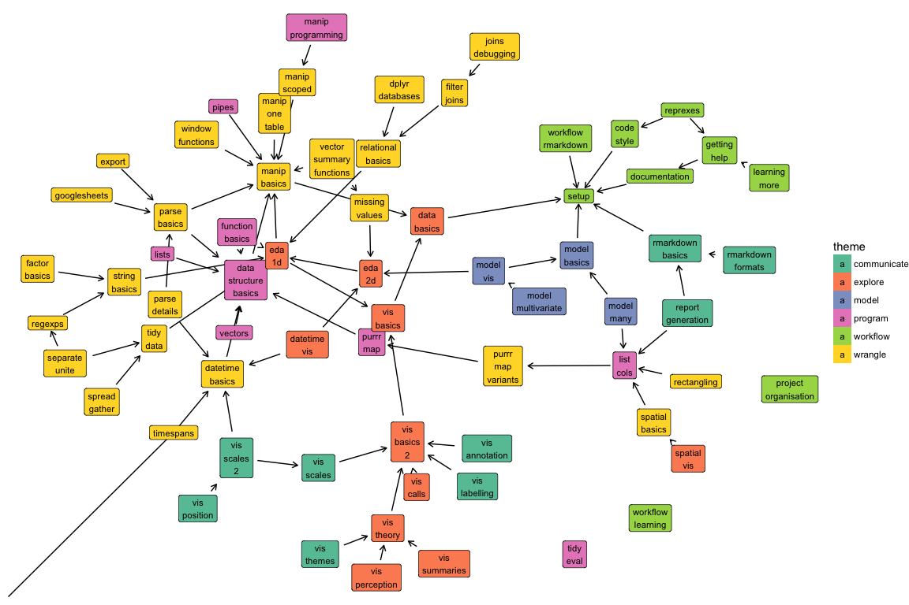

# Data Challenge Lab

This repository contains the draft curriculum for the Stanford [Data Challenge Lab](https://datalab.stanford.edu/challenge-lab).

The curriculum is composed of small __units__ and bigger __challenges__. A unit is a set of guided readings and a handful of low-level exercises (in an `.Rmd`) designed to test that you've understood the material. Challenges are integrative tasks that may take several hours to complete and are contextualised with real data problems. (In terms of Bloom's taxonomy, exercises tend be remember/understand/apply, and challenges are analyse/evaluate/create.) 

The units and challenges will be composed in several ways. So far, we have focused on a __[curriculum](https://dcl-2018-01.github.io/curriculum/)__, a temporal ordering of unit designed to lay out the material into a 5-credit, 10-week course. Challenges are currently private; you must be enrolled in the course to see them.

## Overview

